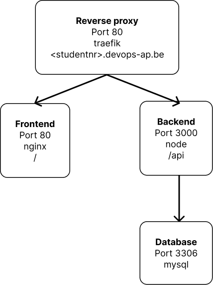

# Projectopdracht

Welkom bij het de repository voor de doorlopende opdracht van DevOps. 

## Situatie

Je werkt voor ACME. Ze hebben onlangs een todo-applicatie ontwikkeld. 
Je wordt gevraagd om een DevOps pipeline uit te werken. Hiervoor zal je op een remote Linux machine werken.

Er zijn twee onderdelen: Back-end en Front-end. Er is geen authenticatie.

De back-end is een NodeJs applicatie die de API host. De back-end luistert op poort 3000. 
De back-end draait standaard in-memory. Met andere woorden, de taken worden enkel opgeslagen in geheugen, niet op disk. 
De back-end kan ook een connectie maken naar een mysql databank. Die stel je in met volgende environment variabelen:

* STORAGE=mysql
* MYSQL_HOST=<hostname>
* MYSQL_USER=<username>
* MYSQL_PWD=$mysqlpwd 
* MYSQL_DB=$mysqldb

De Front-end is een HTML5 statische applicatie en luistert op poort 80. 
Via AJAX calls wordt de API aangeroepen. De front-end en de API moeten op dezelfde host draaien. 
De API draait in een subfolder /api.

## Architectuur



## Opdracht:

1. Connecteer naar je Debian Linux omgeving
1. Clone deze repository
1. Bouw een container voor de back-end. De back-end draait op NodeJS. Kies zelf een tag.
1. Bouw een container voor de front-end. De front-end draait op Nginx. Je maakt gebruik van nginx. Je kan gebruik maken van de standaard configuratie.
1. Maak een docker compose file aan die deze containers refereert. Expose je front-end op poort 80.
1. Voeg Mysql toe aan je netwerk dmv een docker container. Je maakt gebruik van een mysql image. Voeg disk mappings toe zodat de state van je mysql container bewaard blijft.
1. De repository bevat een bestand init.sql. Zorg dat dit wordt uitgevoerd bij de start van de Mysql container. 
1. Configureer de API zodat die deze MySql databank gebruikt.
1. Installeer Traefik als Reverse proxy op je omgeving.
1. Configureer ssl certificaat aanvraag via LetsEncrypt
1. Expose de todo applicatie op ```https://<studentnr>.devops-ap.be```

---UITLEG---

# Docker Compose Project README

Dit README-bestand bevat instructies voor het clonen en starten van een Docker Compose-project.

## Prerequisites

- Docker & Docker Compose geïnstalleerd
- Een werkende Traefik reverse proxy container

## Project gebruiken

2. Clone het project vanuit Git met het volgende commando:

   ```
   git clone https://github.com/your-username/project.git
   ```

2. Voeg een .env file toe en pas dit aan met je eigen gegevens. Of gebruik jenkins om je environment variabelen toe te voegen.
2. Om het programma te starten `docker compose up -d` of doe een build in jenkins
2. Daarna is de todo-list applicatie op beschikbaar op **my_domain.com**
2. En de api kan gebruikt worden met _/api/todos_

### Example .env file

```
DOMAIN=my_domain.com
MYSQL_DATABASE=todo-list
MYSQL_HOST=database
MYSQL_ROOT_PASSWORD=password
MYSQL_USER=mysql_user
MYSQL_PASSWORD=password
```

- **DOMAIN** => hier plaats je eigen domain naam
- **MYSQL_DATABASE** => hier plaats je de naam van je mysql database
- **MYSQL_HOST** => hier plaats je de naam van je mysql host
- **MYSQL_ROOT_PASSWORD** => hier plaats je het mysql root password
- **MYSQL_USER** => hier plaats je de user waarmee je mysql wilt gebruiken
- **MYSQL_PASSWORD** => hier plaats je het user password voor de mysql user

### Example pipeline script

```
pipeline {
    agent { label 'my_domain.com' }

    stages {
        stage('Checkout') {
            steps {
                // Clone the git repository
                git credentialsId: 'git-deploy-key', branch: 'main', url: 'git@github.com:projectopdracht.git'
            }
        }

        stage('Build and deploy') {
            environment{
                DOMAIN = credentials('project-domain')
                MYSQL_DATABASE = credentials('project-mysql-database')
                MYSQL_HOST = credentials('project-mysql-host')
                MYSQL_ROOT_PASSWORD = credentials('project-mysql-root-password')
                MYSQL_USER = credentials('project-mysql-user')
                MYSQL_PASSWORD = credentials('project-mysql-password')

            }
            steps{
                // Commands to deploy app on server
                sh "docker compose up --build -d"
            }
        }
    }
}
```

